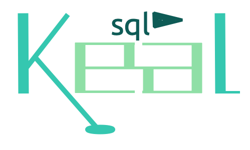

<p align="center"></p>

# KealSql

A Keal-shaped language over PostgreSQL. A `.kealsql` file declares a schema
and queries in the syntax of [Keal](https://github.com/geneacta/keal), and the
compiler — itself a Keal program — turns them into plain PostgreSQL SQL,
ahead of time, type-checked against the schema.

```
table User {
    id:    Id
    name:  Slug
    email: String?
}

table Post {
    id:      Id
    cascade author: RefId<User>
    editor:  RefId<User>?
    title:   String
}

func byAuthor(name: String): List<(Int, String)> {
    from(Post as p)
        .where(p.author.name == name)
        .select(p.id, p.title)
}

func editorOf(post: Int): String? {
    from(Post).where(id == post).select(editor?.name).first()
}
```

```
$ keal src/main.keal blog.kealsql
CREATE TABLE "user" (
    id serial PRIMARY KEY,
    name text UNIQUE NOT NULL,
    email text
);
...
-- func editorOf(post: Int): String?
PREPARE editor_of(integer) AS
SELECT editor.name
FROM post
LEFT JOIN "user" AS editor ON post.editor = editor.id
WHERE post.id = $1
LIMIT 1;
```

The `?.` became a `LEFT JOIN`, and the result type `String?` says a post
with no editor answers `null` rather than vanishing. That is the point of
the project: Keal's null safety, closed `when`, and records, applied to a
schema — so that a query which reads a column the schema does not have, or
puts `NULL` where the schema forbids it, is a **compile error**, not a
surprise at run time.

It is **not a fork of PostgreSQL.** The output is SQL for an unmodified
server; nothing runs but the planner PostgreSQL already has.

* [DESIGN.md](DESIGN.md) — the decisions and the reasons: why a transpiler,
  `Bool3`, `Id` / `Slug`, references, migrations.
* [GRAMMAR.md](GRAMMAR.md) — the syntax, the well-formedness rules, and
  what each construct compiles to.
* [examples/shop.kealsql](examples/shop.kealsql) — a shop: six tables,
  two enums, twenty-odd queries and mutations, as an application would
  ship them; `shop.sql` is what they compile to and `shop.exec.sql` runs
  them on data.

## Running it

KealSql needs the Keal toolchain on the path, or beside the repository at
`../keal` — at least `2790611` (after 1.2.0): `runCommand` with a standard
input, `keal_runtime_init`, `Nothing` in the C backend, and the public
lexer.

```sh
keal src/main.keal file.kealsql                          # print the SQL
keal src/main.keal --migrate file.kealsql --db mydb      # the migration from a live database to the file
keal src/main.keal --migrate file.kealsql --db mydb --destructive
keal src/main.keal --plkeal build/ file.kealsql          # the stored functions as a Keal program + build.sh
keal src/main.keal --lib build/file.so file.kealsql      # the SQL, CREATE FUNCTION naming that library
tests/run.sh                                              # the suite: every case, byte for byte
```

`--migrate` reads the database through `psql` (`--db` is its `-d`; the
`PG*` environment and `~/.pgpass` work as for `psql`) and prints the
statements that bring it to the file, to review. Destructive ones — drops,
narrowed types, a new `NOT NULL` — are held back as comments, each with
what it would cost, until `--destructive`. A rename is written where it
happens, `renamed(bio) about: String?` or `renamed(Post) table Article`,
because a diff cannot tell a rename from a drop and an add.

A `stored func` is Keal that runs **inside** PostgreSQL, as a
`LANGUAGE C` function — the fastest procedural language the server has:

```
stored pure func slugify(s: String): String { ...ordinary Keal... }

func slugs(): List<(String, String)> {
    from(User).select(name, slugify(name))
}
```

A `trigger` is the same, on every row written — `row` and `old` are the
table's record, a `before` body answers the row to store, a `throw`
refuses the write:

```
trigger normalizeSku on Product before insert {
    return row.with(sku = row.sku.toUpper())
}
```

`--plkeal` writes the Keal program and a `build.sh` (Keal to C, then the C
compiler against the server headers); the file's SQL carries the
`CREATE FUNCTION`s and `CREATE TRIGGER`s. A panic inside becomes a SQL error, and the backend
lives on. Values are `Int`, `Float`, `Bool`, `String`; the functions are
STRICT, so a null answers null without a call.

Inside a stored function, the file's own queries are Keal functions with
Keal results — `userNamed(name)` answers a `User?`, a record; `posts(id)`
a list of rows with fields named after the columns — and a query that
fails is a Keal exception, rolled back, catchable with `try`:

```
stored func totalScore(name: String): Int {
    val u = userNamed(name)
    if (u == null) { return 0 }
    var sum = 0
    for (p in posts(u.id)) { sum += p.score ?: 0 }
    return sum
}
```

When PostgreSQL's `initdb` is on the machine, the suite also starts a
private server in a temporary directory — no root, no configuration — loads
every case's SQL into a fresh database, runs the `*.exec.sql` beside it in
the same session, and compares the rows to `*.exec.out`; each
`tests/migrations/*/` is built from `before.kealsql`, migrated to
`after.kealsql`, applied in one transaction, and diffed again until it
settles; each `tests/plkeal/*.kealsql` has its library built (server
headers and a C compiler needed) and loaded, and its functions run.
Without `initdb` it says so and compares the SQL only.

The compiler runs on Keal's VM as written, and `keal build src/main.keal
-o kealsql` compiles it to a native binary; the suite builds that binary
and holds it to the same bytes as the VM on every case. The lexer is
Keal's own, imported from the `keal` dependency pinned in `keal.toml`;
`keal fetch` puts it under `.keal/deps/` (the suite runs it when missing).

## Layout

| | |
|---|---|
| `keal.toml` | the `keal` dependency, pinned to a commit: the lexer is imported from it |
| `src/ast.keal` | the syntax tree |
| `src/parser.keal` | items (`table`, `enum`, `func`, `proc`, `stored func`) and Keal's expression precedence over Keal's tokens; `===`, `!==` and `unknown` are read here |
| `src/schema.keal` | the resolved schema and SQL naming |
| `src/compile.keal` | checker and emitter, one pass: a `Val` is an expression's SQL and its type |
| `src/catalog.keal` | the live schema, read from `pg_catalog` through `psql` |
| `src/migrate.keal` | the diff: declared against live, as statements to review |
| `src/plkeal.keal` | the stored functions as a Keal program with PostgreSQL entry points, and its build script |
| `src/main.keal` | the command |
| `tests/cases/*.kealsql` | each compiles to exactly its `.sql` |
| `tests/errors/*.kealsql` | each fails with exactly its `.err` |
| `tests/cases/*.exec.sql` | run on PostgreSQL after the case's SQL; the rows must be exactly `.exec.out` |
| `tests/migrations/*/` | `before.kealsql` → `after.kealsql` must print `expected.sql`, apply, then settle to `settled.sql` |
| `tests/plkeal/*.kealsql` | compiled to `.sql`; the library is built, loaded, and `.exec.sql` must print `.exec.out` |
| `examples/*.kealsql` | real files, held to the same checks as `tests/cases/` |

## Status

v1 covers the schema (`table`, `enum`, keys, references, `on delete`,
defaults, named checks, indexes, arrays, `Decimal`, `Timestamptz`, `Json`
and the other common types), the DDL, and queries: `from` / `where` / `unless` / `join` / `leftJoin` /
`orderBy` / `groupBy` / `distinct` / `limit` / `offset`, `fullJoin` /
`crossJoin`, `union` / `intersect` / `except`, the terminals `select` /
`count` / `exists` with `first` / `single`, subqueries through `val`-bound
fragments and `in`, `view`s, `recursive` common table expressions, window
functions, text, date, cast and json functions, the aggregates, `insert`
of several rows with `onConflict`, `insertInto` from a query, `update` /
`delete` through a `join`, `sql("...")` as the typed escape hatch, `when`,
`?:`, the eight
connectives with Kleene's tables on `Bool3`, and reference paths as
implicit joins; the migration diff against a live database, with
renames declared and destructive steps held back; and `plkeal`, stored
functions (scalar or `SETOF`) and triggers in Keal compiled to
`LANGUAGE C`, calling the file's queries through SPI with typed results — all of it compiled
natively as well as run on the VM.

Licensed under Apache-2.0, like Keal.
